# moe-theme
<a href="https://raw.github.com/kuanyui/moe-theme.el/master/pics/moe-theme.png"></a>

> ## Acknowedgement
> Latest version is under inactive development. I haven't finished it indeed, however, I personally have already used it for quite a long time.
>
> Currently free time is precious for me, to rest from work, to learn foreign languages, to study Harmony & Voice Leading, to compose, to practice piano and violin, to exercise. So I will not spend more massive time on this project for any large modification. I've ever spent too much time on this project before to hold more passion and patience to write merely a color theme, even not an application. (You will not believe how much it is if you has never done such tedious task for EACH mode and find a color balances manually for them) I think it's enough now.
>
> **If you want to try or help to QA the latest development version, see `dev` branch.**
>
> **If you want to make `moe-theme` supports more modes, please send a PR (but be aesthetic; too ugly color balance will be rejected.^^||| )**. Currently I honestly has no more free time and passion on such a tedious time-costing trial-and-error task.
>
> The last but not the least, thanks for your using and happy hacking!


>**Table of Contents**
- [moe-theme](#moe-theme)
  - [Screenshot](#screenshot)
  - [What Special?](#what-special)
  - [Support](#support)
  - [Requirements](#requirements)
  - [Download](#download)
    - [Via package.el](#via-packageel)
    - [Manually](#manually)
  - [Customizations](#customizations)
    - [Resize Titles](#resize-titles)
    - [Colorful Mode-line and Powerline](#colorful-mode-line-and-powerline)
      - [Powerline](#powerline)
    - [Too Yellow Background?](#too-yellow-background)
    - [Highlight Buffer-id on Mode-line?](#highlight-buffer-id-on-mode-line)
  - [Have A Good Mood Today?](#have-a-good-mood-today)
    - [Live in Antarctica?](#live-in-antarctica)
  - [Notes](#notes)
    - [No 256-Color Output?](#no-256-color-output)
    - [Paren](#paren)
  - [Known Issues](#known-issues)
  - [Todo](#todo)
  - [License](#license)


## Screenshot
<a href="https://raw.github.com/kuanyui/moe-theme.el/master/pics/dark01.png">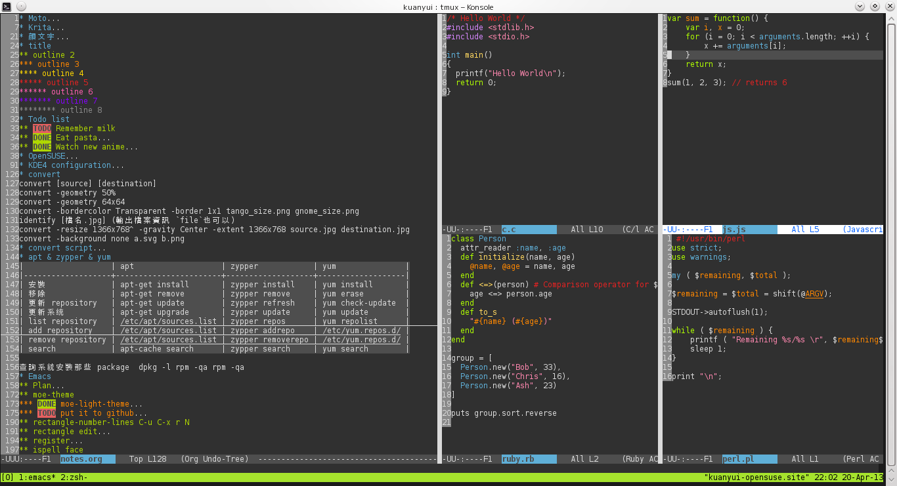</a>
<a href="https://raw.github.com/kuanyui/moe-theme.el/master/pics/light01.png">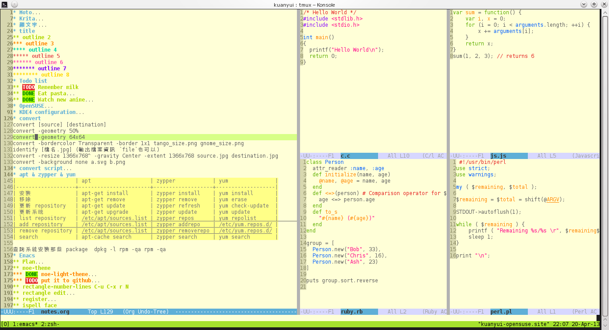</a>
<a href="https://raw.github.com/kuanyui/moe-theme.el/master/pics/dark02.png">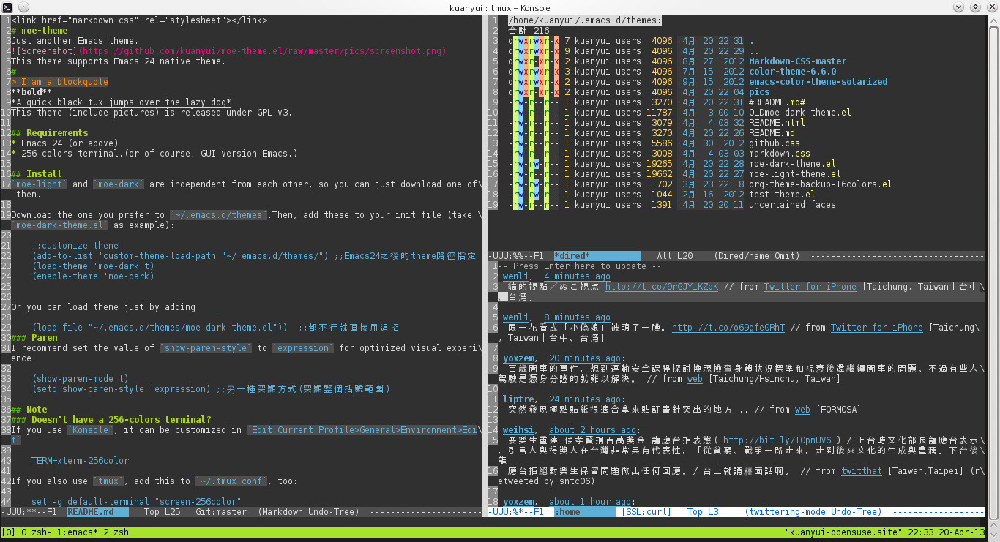</a>
<a href="https://raw.github.com/kuanyui/moe-theme.el/master/pics/light02.png">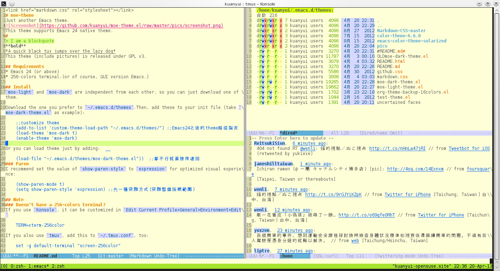</a>
<a href="https://raw.github.com/kuanyui/moe-theme.el/master/pics/dark03.png">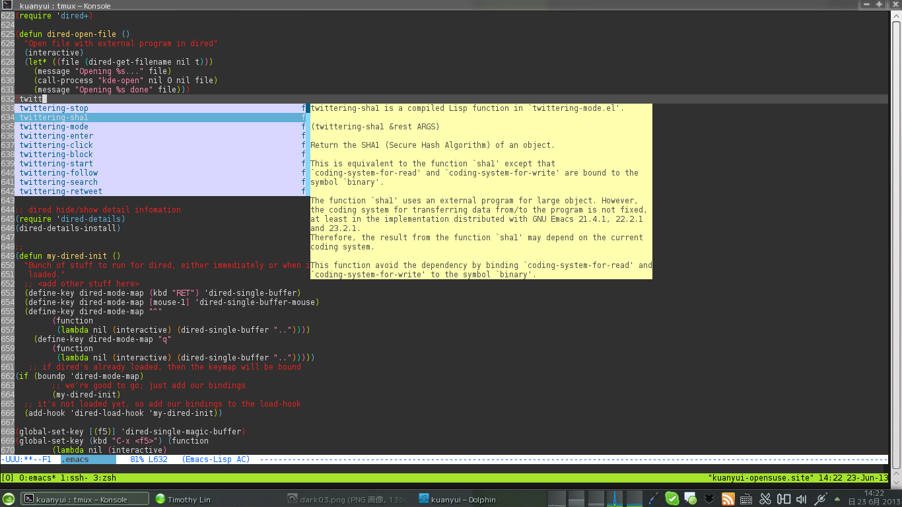</a>
<a href="https://raw.github.com/kuanyui/moe-theme.el/master/pics/light03.png">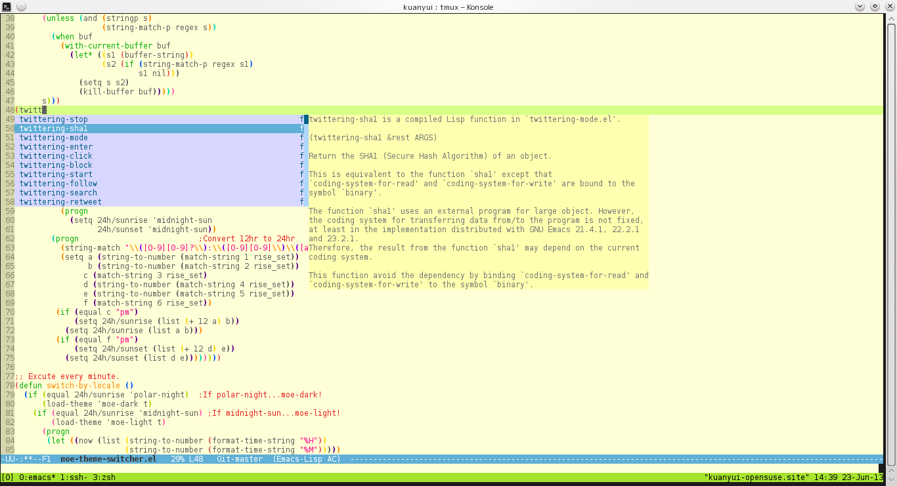</a>
<a href="https://raw.github.com/kuanyui/moe-theme.el/master/pics/dark04.png">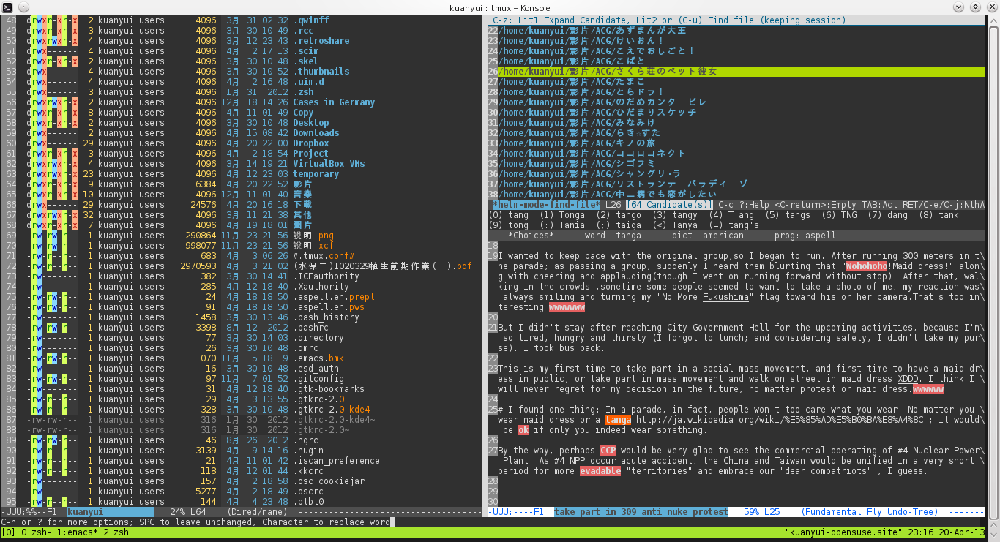</a>
<a href="https://raw.github.com/kuanyui/moe-theme.el/master/pics/light04.png">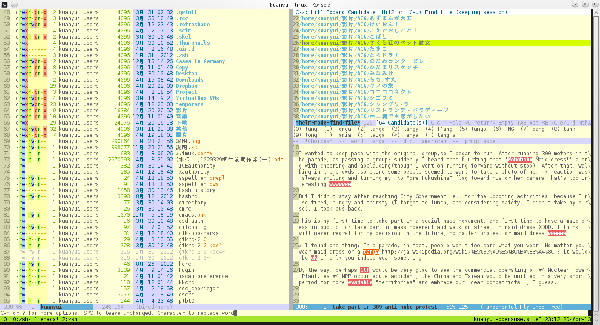</a>
<a href="https://raw.github.com/kuanyui/moe-theme.el/master/pics/dark05.png">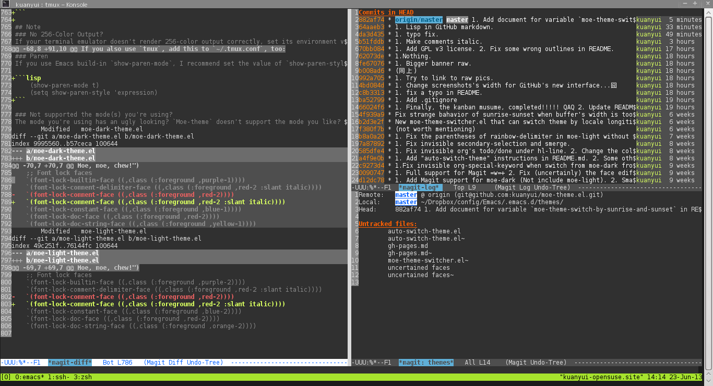</a>
<a href="https://raw.github.com/kuanyui/moe-theme.el/master/pics/light05.png">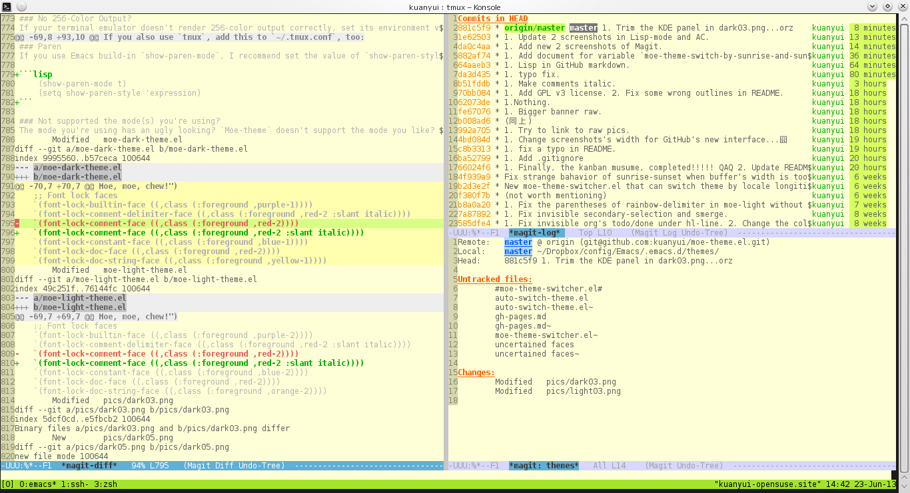</a>
<a href="https://raw.github.com/kuanyui/moe-theme.el/master/pics/mode-line-preview.png">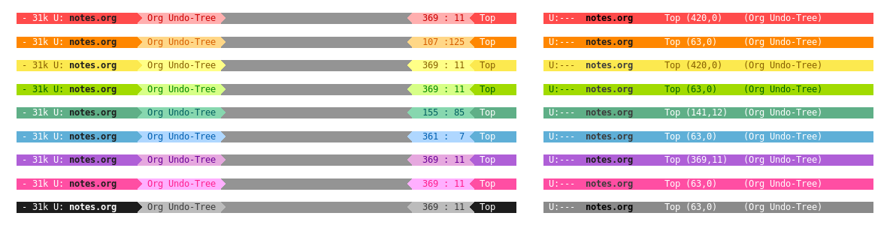</a>

## What Special?
* Optimized for terminal's 256 color palettes.
* Black-on-white & white-on-black.
* Delightful and cheerful color palettes.
* Quite completed (and reasonable) font faces for each mode.
* **Easy to customize!**
    * Colorful Mode-line / Powerline.
    * Enlarge titles font sizes or not.
    * Automatically switch between dark and light `moe-theme` by local time! (optional)

## Support
`moe-theme.el` provide good-looking™ and quite fully-supported font-faces for various modes, include:
* Diff / EDiff
* Dired / Dired+
* ERC / rcirc
* Eshell / Ansi-term
* Gnus / Message
* Helm / ido
* Org-mode / Agenda / calfw
* Magit / Git-commit / Git-gutter
* Markdown-mode / ReStructText-mode
* Auto-complete-mode / Company
* Rainbow-delimiters
* Swoop
* Twittering-mode
* undo-tree / Neotree
* Ruby / Haskell / CPerl / Tuareg / Web-mode
* ......and More!

## Requirements
* Emacs 24 or above.
* 256-colors (or higher) terminal.

## Download
### Via package.el
`Moe-theme` is available in [MELPA](https://github.com/milkypostman/melpa) repository now, so you can install `moe-theme` easily with `M-x` `list-packages`.

### Manually
Download the archive of `moe-theme` (or `git clone` it) to `~/.emacs.d/moe-theme.el` and extract it. Then, add these to your init file:

```lisp
	;;customize theme
	(add-to-list 'custom-theme-load-path "~/.emacs.d/moe-theme.el/")
    (add-to-list 'load-path "~/.emacs.d/moe-theme.el/")
    (require 'moe-theme)
```

## Customizations
It's impossible to satisfy everyone with one fixed theme, but `moe-theme` provide some easy ways to customize itself.

There's a full customization example:

```lisp
    ;; If you want to use powerline, (require 'powerline) must be
    ;; before (require 'moe-theme).
    (add-to-list 'load-path "~/.emacs.d/PATH/TO/powerline/")
    (require 'powerline)

    ;; Moe-theme
    (add-to-list 'custom-theme-load-path "~/.emacs.d/PATH/TO/moe-theme/")
    (add-to-list 'load-path "~/.emacs.d/PATH/TO/moe-theme/")
    (require 'moe-theme)

    ;; Show highlighted buffer-id as decoration. (Default: nil)
    (setq moe-theme-highlight-buffer-id t)

    ;; Resize titles (optional).
    (setq moe-theme-resize-markdown-title '(1.5 1.4 1.3 1.2 1.0 1.0))
    (setq moe-theme-resize-org-title '(1.5 1.4 1.3 1.2 1.1 1.0 1.0 1.0 1.0))
    (setq moe-theme-resize-rst-title '(1.5 1.4 1.3 1.2 1.1 1.0))

    ;; Choose a color for mode-line.(Default: blue)
    (moe-theme-set-color 'cyan)

    ;; Finally, apply moe-theme now.
    ;; Choose what you like, (moe-light) or (moe-dark)
    (moe-light)
```

If you have any question about settings, go on and read following README to get more detailed information first.

>#### Note
>**Notice that the file `moe-theme.el` is NOT a theme file, but it provide the ability for customization `moe-dark-theme` & `moe-light-theme`.**
>
>So, if you just want to use `load-theme` to apply **ONLY** `moe-theme` itself and **without customizations**, you can skip "Customizations" chapter and just use this:
>
>```lisp
>    (add-to-list 'custom-theme-load-path "~/.emacs.d/PATH/TO/moe-theme/")
>
>    (load-theme 'moe-dark t)
>    ;;or
>    (load-theme 'moe-light t)
>```

### Resize Titles
You may want to resize titles in `markdown-mode`, `org-mode`, or `ReStructuredText-mode`:

```lisp
  ;; Resize titles
  (setq moe-theme-resize-markdown-title '(2.0 1.7 1.5 1.3 1.0 1.0))
  (setq moe-theme-resize-org-title '(2.2 1.8 1.6 1.4 1.2 1.0 1.0 1.0 1.0))
  (setq moe-theme-resize-rst-title '(2.0 1.7 1.5 1.3 1.1 1.0))
```

>Markdown should have 6 items; org has 9 items; rst has 6 items.
>
>Make sure that these resizing settings should be placed **before** `(moe-dark)` or `(moe-light)`.

The values should be lists. Larger the values, larger the fonts.
If you don't like this, just leave them nil, and all the titles will be the same size.

### Colorful Mode-line and Powerline
Tired of boring blue mode-line? You can set default mode-line color. moe-theme provides 9 colors mode-line style. Add following lines **after** `(moe-light)` or `(moe-dark)`:

```lisp
  (moe-theme-set-color 'orange)
  ;; (Available colors: blue, orange, green ,magenta, yellow, purple, red, cyan, w/b.)
```

You can also use `M-x` `moe-theme-select-color` to change color interactively.

Mayby you'll like `M-x` `moe-theme-random-color`, too; which gives you a random mood :D.

#### Powerline
Now `moe-theme` supports [Powerline](https://github.com/milkypostman/powerline), which makes mode-line looks fabulous! We recommended installing `powerline` and run `powerline-moe-theme`.

>Make sure that `(require 'powerline)` must be placed **before** `(require 'moe-theme)`. Otherwise, `powerline-moe-theme` will not be initallized.

You can add this line to your init file:

```lisp
(powerline-moe-theme)
```

### Too Yellow Background?
With 256-colors terminal, default yellow background of moe-light may be too yellow and harsh to eyes on some screens.

If you encounter this problem, and want to set background color to `#ffffff` in terminal, set the value of `moe-light-pure-white-background-in-terminal` to t. Add this line **before** `(moe-light)` or `(moe-dark)`:

```lisp
    (setq moe-light-pure-white-background-in-terminal t)
```
### Highlight Buffer-id on Mode-line?
You may be dislike default highlight on mode-line-buffer-id, now it can be disable by setting the value of `moe-theme-highlight-buffer-id` to nil. Add this line **before** `(moe-light)` or `(moe-dark)`:

```lisp
(setq moe-theme-highlight-buffer-id nil)
```

## Have A Good Mood Today?
I prefer a terminal with a black-on-white color scheme. I found that in the daytime, sunlight is strong and black-on-white is more readable; However, white-on-black would be less harsh to the eyes at night.

So if you like, you can add the following line to your `~/.emacs` to automatically switch between `moe-dark` and `moe-light` according to the system time:

```lisp
	(require 'moe-theme-switcher)
```

By adding the line above, your Emacs will have a light theme in the day and a dark one at night. =w=+

### Live in Antarctica?
Daytime is longer in summer but shorter in winter; or you live in a high latitude region which midnight-sun or polar-night may occur such as Finland or Antarctica?

There's a variable `moe-theme-switch-by-sunrise-and-sunset` would solve your problem (default value is `t`)

If this value is `nil`, `moe-theme-switcher` will switch theme at fixed time (06:00 and 18:00).

If this value is `t` and both `calendar-latitude` and `calendar-longitude` are set properly, the switching will be triggered at the sunrise and sunset time of the local calendar.

Take "Keelung, Taiwan" (25N,121E) for example, you can set like this:

```lisp
	(setq calendar-latitude +25)
	(setq calendar-longitude +121)
```

## Notes
### No 256-Color Output?
If your terminal emulator doesn't render 256-color output correctly, set its environment variable `TERM` to `xterm-256color`. For example:

- If you are using `bash` or `zsh`, add following line into your `~/.bashrc` or `~/.zshrc`:

	export TERM=xterm-256color

- Or if you are using `Konsole`, navigate to `Edit Current Profile > General > Environment > Edit` and add the following line:

    TERM=xterm-256color

- If you're using `tmux` and it cannot display in 256-color correctly, add this to `~/.tmux.conf`, too:

    set -g default-terminal "screen-256color"

### Paren
If you use Emacs build-in `show-paren-mode`, I recommend set the value of `show-paren-style` to `expression` for optimized visual experience:

```lisp
    (show-paren-mode t)
    (setq show-paren-style 'expression)
```

## Known Issues
* If you add `(moe-dark)` or `(moe-light)` to your init file, the color of `buffer-id` would be incorrect after startuping CLI Emacs(but if you `M-x moe-dark/light` again, it would be corrected immediately). I don't know why, but this issue doesn't occur in GUI version Emacs. (Tested on GNU Emacs 24.3.90.1 2014-04-11)
* When using `moe-light` and typing characters under terminal emulator (e.g. Konsole) with IM (e.g. fcitx), the string embedded in Emacs may be very insignificant (But as you output the word from IM, it turns normal).

## Todo
* Minor mode for `moe-theme-switcher`.

## License
`moe-theme.el` (include images) is released under GPL v3. Copyleft is so cute!
